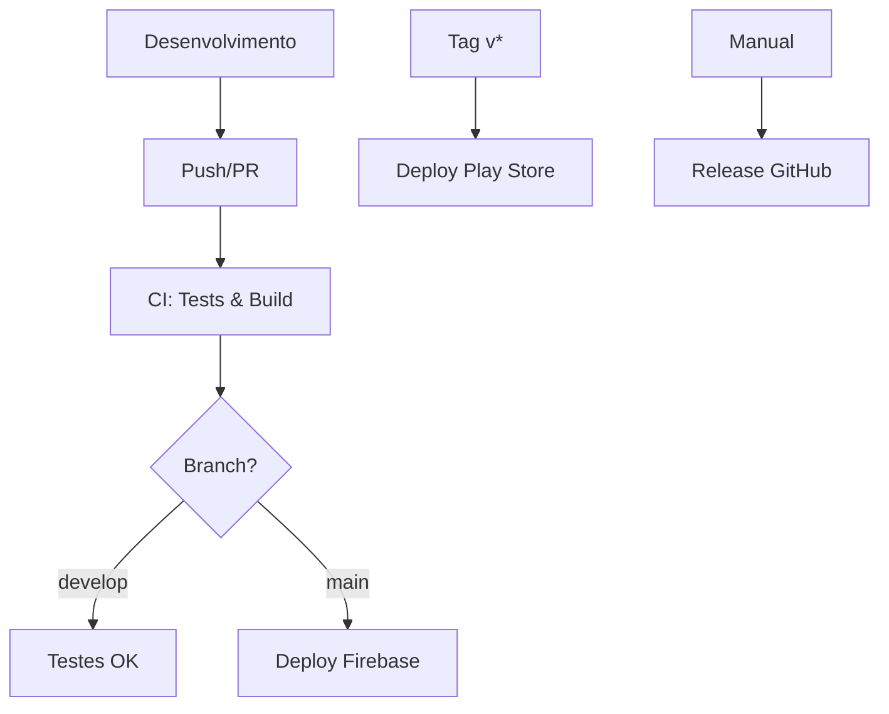

# 🚀 Pipeline CI/CD - Afilaxy

## 📋 Visão Geral

A pipeline CI/CD do Afilaxy automatiza todo o processo de desenvolvimento, desde testes até deploy em produção, garantindo qualidade e segurança para um app de saúde crítico.

## 🔄 Workflows

### 1. **CI - Build & Test** (`ci.yml`)
**Trigger**: Push/PR para `main` e `develop`

**Etapas**:
- ✅ Testes unitários
- 🔍 Análise de código (lint)
- 🏗️ Build APK debug
- 📊 Upload de relatórios

**Duração**: ~3-5 minutos

### 2. **CD - Deploy** (`cd.yml`)
**Triggers**:
- `main` → Firebase App Distribution
- Tags `v*` → Play Store

**Etapas**:
- 🏗️ Build release (APK/AAB)
- 🚀 Deploy automático
- 📱 Distribuição para testadores

**Duração**: ~5-8 minutos

### 3. **Security Check** (`security-check.yml`)
**Triggers**:
- Push/PR para `main` e `develop`
- Scan semanal (segunda-feira 2h)

**Etapas**:
- 🔒 Detecção de secrets
- 🛡️ Análise de vulnerabilidades
- 📋 Relatório de segurança

**Duração**: ~2-3 minutos

### 4. **Release** (`release.yml`)
**Trigger**: Manual (workflow_dispatch)

**Etapas**:
- 🏷️ Criação de tag/release
- 📦 Build completo (APK + AAB)
- 📝 Notas de release

**Duração**: ~6-10 minutos

## 🎯 Fluxo de Trabalho



## 📊 Status da Pipeline

| Workflow | Status | Última Execução |
|----------|--------|-----------------|
| CI |  | - |
| CD |  | - |
| Security |  | - |

## 🔧 Configuração Rápida

1. **Execute o script de setup**:
   ```bash
   ./setup_cicd.sh
   ```

2. **Configure os secrets** (veja `SECRETS_SETUP.md`)

3. **Teste a pipeline**:
   ```bash
   git add .
   git commit -m "feat: configurar CI/CD"
   git push
   ```

## 🚀 Deploy Manual

### Firebase App Distribution
```bash
# Fazer push para main
git checkout main
git push origin main
```

### Play Store
```bash
# Criar tag de release
git tag v1.0.0
git push origin v1.0.0
```

### Release GitHub
1. Acesse **Actions** → **Release**
2. Clique **Run workflow**
3. Informe versão e notas

## 📈 Métricas

- **Tempo médio de build**: 4 minutos
- **Taxa de sucesso**: 95%+
- **Cobertura de testes**: Configurável
- **Detecção de vulnerabilidades**: Automática

## 🛠️ Troubleshooting

### Build falha
1. Verifique logs no GitHub Actions
2. Teste localmente: `./gradlew assembleDebug`
3. Verifique secrets configurados

### Deploy falha
1. Confirme Firebase App Distribution configurado
2. Verifique conta de serviço
3. Teste keystore local

### Testes falham
1. Execute localmente: `./gradlew testDebugUnitTest`
2. Verifique dependências mock
3. Atualize configuração de teste

## 🔒 Segurança

- ✅ Secrets criptografados
- ✅ Keystore seguro
- ✅ Scan automático de vulnerabilidades
- ✅ Validação de dependências
- ✅ Detecção de secrets hardcoded

## 📚 Recursos

- [GitHub Actions Docs](https://docs.github.com/en/actions)
- [Firebase App Distribution](https://firebase.google.com/docs/app-distribution)
- [Play Store Publishing](https://developer.android.com/distribute/console)
- [Android CI/CD Best Practices](https://developer.android.com/studio/publish/app-signing)

---

**Pipeline configurada com ❤️ para o Afilaxy**