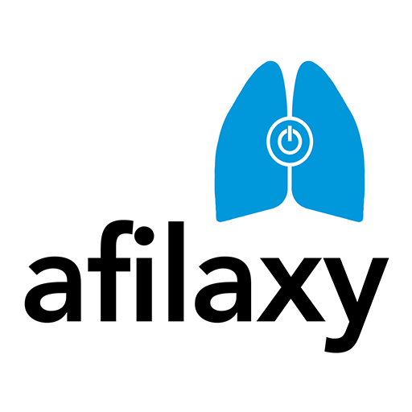

# 🫁 Afilaxy

<p align="center">
  
</p>

<p align="center">
  <strong>Conectando pessoas com asma em situações de emergência</strong>
</p>

<p align="center">
  <a href="https://kotlinlang.org/"></a>
  <a href="https://developer.android.com/jetpack/compose"></a>
  <a href="https://firebase.google.com/"></a>
  <a href="LICENSE"></a>
</p>

## 📱 Sobre o Projeto

O **Afilaxy** é um aplicativo Android que identifica a pessoa mais próxima com uma "bombinha" de asma em casos emergenciais. Desenvolvido para alcançar pacientes fora do ambiente clínico, o app entrega boas práticas médicas, engajando pacientes no tratamento disponibilizado pelo SUS.

### 🎯 Missão
Facilitar o acesso a medicamentos de emergência para asma e promover o engajamento de pacientes ao tratamento através da tecnologia.

## ✨ Funcionalidades

### 🔐 Autenticação e Segurança
- **Firebase Authentication**: Cadastro, login seguro e verificação de e-mail
- **Recuperação de senha**: Sistema robusto de recuperação de acesso
- **Validação de campos**: Mensagens de erro em português com feedback visual

### 🗺️ Geolocalização e Comunidade
- **Mapeamento em tempo real**: Localização de usuários próximos com medicamentos
- **Sistema de emergência**: Solicitação rápida de ajuda em crises de asma
- **Comunidade**: Tela dedicada com produtos, eventos e informações sobre o projeto

### 🎨 Interface Moderna
- **Jetpack Compose**: Interface nativa, responsiva e intuitiva
- **Material Design 3**: Design system moderno e acessível
- **Tema customizado**: Cores e componentes adaptados para saúde

### 🔔 Notificações (Em Desenvolvimento)
- **Firebase Cloud Messaging**: Alertas de emergência em tempo real
- **Notificações de proximidade**: Avisos quando ajuda está disponível próxima

## 🏗️ Arquitetura

O projeto segue os princípios da **Clean Architecture** e **MVVM**:

```
app/
├── src/main/java/com/afilaxy/
│   ├── data/              # Repositórios e fontes de dados
│   ├── domain/            # Modelos de negócio e casos de uso
│   │   └── model/         # Entidades (User, Evento, Produto, etc.)
│   ├── presentation/      # UI e ViewModels
│   │   ├── auth/          # Telas de autenticação
│   │   ├── comunidade/    # Tela da comunidade e componentes
│   │   ├── emergency/     # Funcionalidades de emergência
│   │   └── main/          # Tela principal e navegação
│   ├── ui/
│   │   └── theme/         # Tema e estilos customizados
│   └── MainActivity.kt    # Activity principal
└── res/
    ├── drawable/          # Recursos visuais e logos
    ├── values/            # Strings, cores e dimensões
    └── ...
```

## 🚀 Como executar o projeto

### Pré-requisitos
- **Android Studio** Flamingo ou superior
- **JDK 17** ou superior
- **Android SDK** versão 34+
- **Dispositivo/Emulador** com Android 7.0+ (API 24)

### Configuração

1. **Clone o repositório:**
   ```bash
   git clone https://github.com/herb-sin/afilaxy.git
   cd afilaxy
   ```

2. **Configure o Firebase:**
   - Crie um projeto no [Firebase Console](https://console.firebase.google.com/)
   - Ative **Authentication** com método e-mail/senha
   - Ative **Firestore Database**
   - Ative **Cloud Messaging** (opcional)
   - Baixe o arquivo `google-services.json` e coloque em `app/`
   - **IMPORTANTE**: Copie `app/google-services.json.example` para `app/google-services.json` e substitua os valores pelos seus dados do Firebase

3. **Abra o projeto no Android Studio**

4. **Sincronize as dependências:**
   ```bash
   ./gradlew build
   ```

5. **Execute o aplicativo:**
   - Conecte um dispositivo Android ou inicie um emulador
   - Clique em "Run" no Android Studio

## 🔒 Configuração de Segurança

### Firebase Configuration
1. Copie o arquivo template:
   ```bash
   cp app/google-services.json.example app/google-services.json
   ```

2. Edite `app/google-services.json` com suas credenciais do Firebase:
   - `project_number`: Número do seu projeto Firebase
   - `project_id`: ID do seu projeto Firebase
   - `mobilesdk_app_id`: ID da aplicação móvel
   - `current_key`: Sua chave de API do Firebase

3. **NUNCA** commite o arquivo `google-services.json` real no controle de versão.

## 🛠️ Tecnologias Utilizadas

| Categoria | Tecnologia | Versão |
|-----------|------------|--------|
| **Linguagem** | Kotlin | 1.9+ |
| **UI Framework** | Jetpack Compose | 1.5+ |
| **Arquitetura** | MVVM + Clean Architecture | - |
| **Backend** | Firebase | Latest |
| **Autenticação** | Firebase Auth | Latest |
| **Banco de Dados** | Firebase Firestore | Latest |
| **Mapas** | Google Maps SDK | - |
| **Notificações** | Firebase Cloud Messaging | Latest |
| **Navegação** | Navigation Compose | Latest |
| **Injeção de Dependência** | Hilt/Dagger | Latest |

## 📊 Funcionalidades por Tela

### 🏠 Tela Principal
- Dashboard com status do usuário
- Botão de emergência destacado
- Navegação para outras seções

### 🆘 Tela de Emergência
- Solicitação de ajuda com um toque
- Localização automática
- Lista de pessoas próximas com medicamentos

### 👥 Tela da Comunidade
- **Produtos**: Informações sobre medicamentos para asma
- **Eventos**: Lives, palestras e atividades educativas
- **Sobre o Projeto**: Missão, visão e impacto social

### 🔐 Autenticação
- Login e cadastro intuitivos
- Validação em tempo real
- Recuperação de senha segura

## 🤝 Contribuição

Contribuições são muito bem-vindas! Este projeto tem um impacto social importante.

### Como contribuir:

1. **Fork** o projeto
2. **Crie** uma branch para sua feature (`git checkout -b feature/nova-funcionalidade`)
3. **Commit** suas mudanças (`git commit -m 'Adiciona nova funcionalidade'`)
4. **Push** para a branch (`git push origin feature/nova-funcionalidade`)
5. **Abra** um Pull Request

### Diretrizes:
- Siga os padrões de código existentes
- Adicione testes quando necessário
- Documente mudanças significativas
- Mantenha commits pequenos e descritivos

## 🚀 Pipeline CI/CD

O Afilaxy possui uma pipeline completa de CI/CD para garantir qualidade e deploy automático:

- ✅ **CI**: Testes automáticos e build em cada commit
- ✅ **CD**: Deploy automático para Firebase App Distribution e Play Store
- ✅ **Security**: Scan de vulnerabilidades e detecção de secrets
- ✅ **Release**: Criação automática de releases versionadas

**Setup rápido**: Execute `./setup_cicd.sh` e siga as instruções.

📚 **Documentação completa**: [.github/README_CICD.md](.github/README_CICD.md)

## 📋 Roadmap

- [x] Sistema de autenticação
- [x] Interface com Jetpack Compose
- [x] Tela da comunidade
- [x] Implementação completa de geolocalização
- [x] Sistema de notificações push
- [x] Pipeline CI/CD completa
- [ ] Integração com mapas
- [ ] Testes automatizados expandidos
- [ ] Publicação na Play Store

## 🎯 Impacto Social

O Afilaxy representa uma ponte tecnológica entre pacientes com asma e o Sistema Único de Saúde (SUS), promovendo:

- **Acesso rápido** ao medicamento em emergências
- **Educação em saúde** através da comunidade
- **Engajamento** no tratamento contínuo
- **Solidariedade** entre pacientes

## 📄 Licença

Este projeto está licenciado sob a Licença MIT - veja o arquivo [LICENSE](LICENSE) para detalhes.

## 👨💻 Desenvolvedor

Desenvolvido com ❤️ por [@herb-sin](https://github.com/herb-sin)

---

